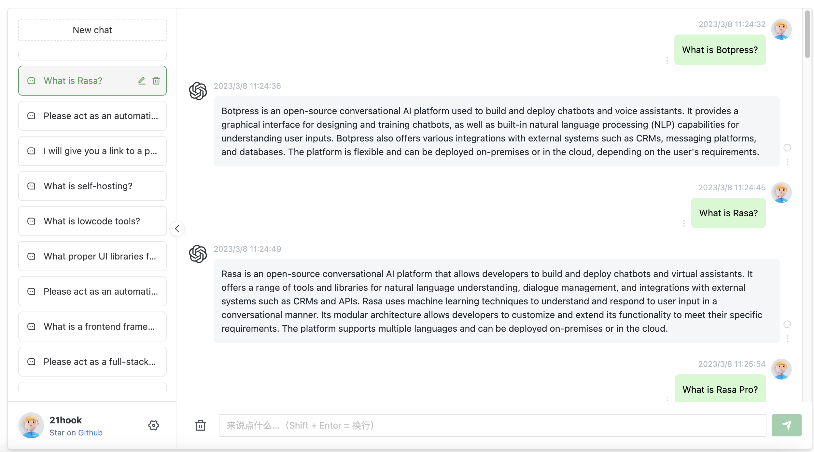

# Project Name
A chatbot that uses gpt-3.5-turbo API to generate responses to user input.

## Installation
Run the following commands to start the project:
```dockerfile
docker pull gindex/nginx-php
docker run -it -d -v /root/chatgpt:/usr/share/nginx/html --name chat-with-gpt -p 8080:80 --restart=always gindex/nginx-php
```
## Usage
Running screenshots:
